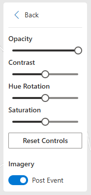
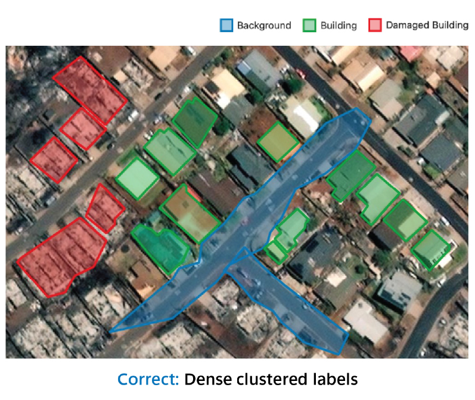
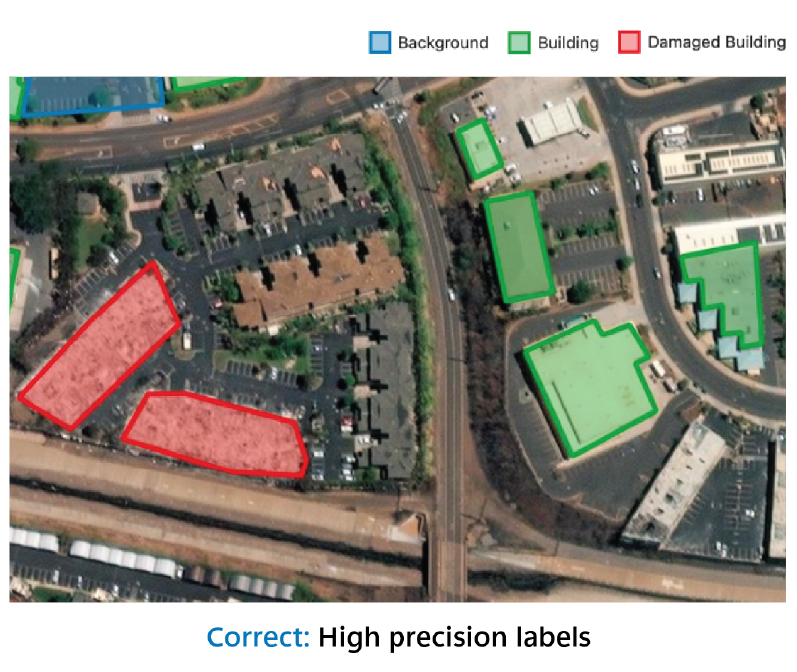
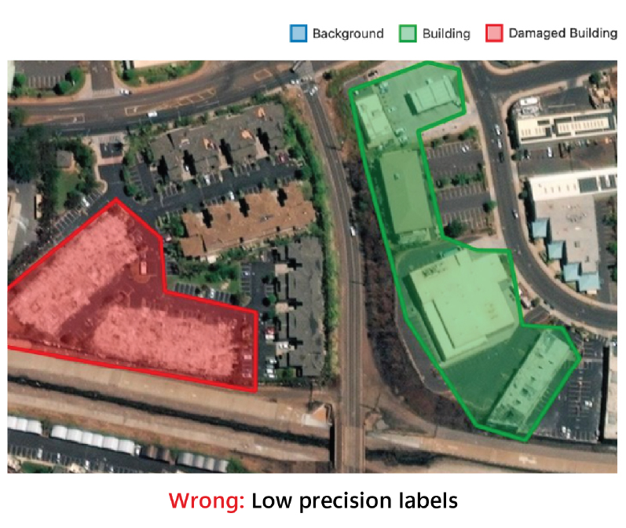
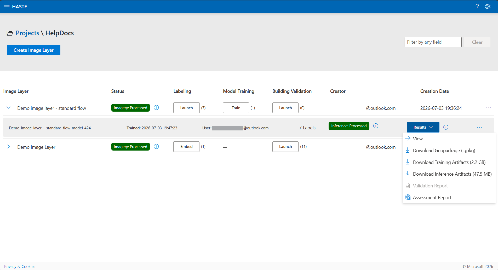
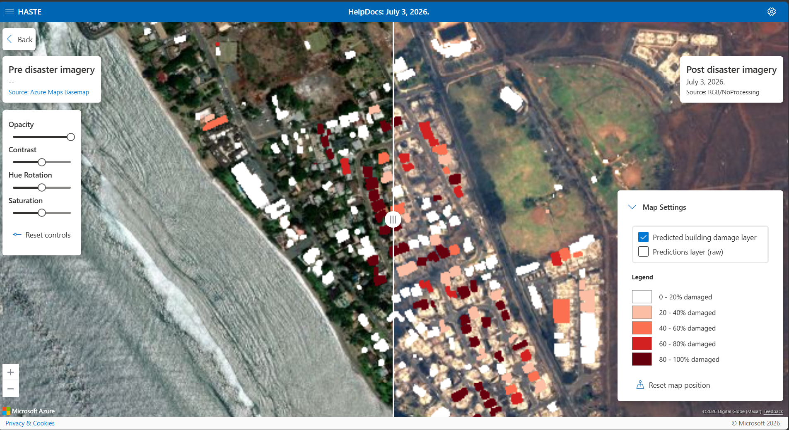
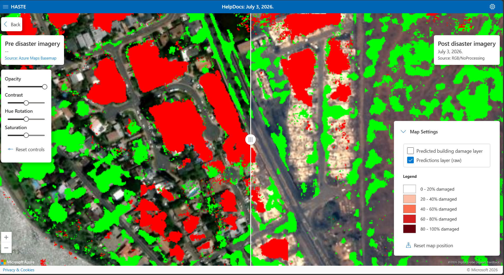

<!-- SOURCE: merged from the in-app Help Docs pages for Labeling, Model Training,
     and Results (ui/src/Components/HelpDocs/HelpDocsLabeling.jsx,
     HelpDocsModelTraining.jsx, HelpDocsResults.jsx). Keep media/steps in sync
     with those in-app pages. -->

# Damage Mapping with a Trained Model

**Goal: produce a wall-to-wall damage map.** You draw labels on a small area, train a
segmentation model on them, and HASTE runs that model across the entire image layer to
generate a continuous damage prediction you can visualize and download as a geopackage.

For a faster, building-level result with no training job, see
{doc}`Rapid Building Assessment <rapid-building-assessment>`.

```{admonition} The workflow at a glance
:class: tip

Standard-workflow layer → **Label** a training area → **Train** a model → **View & export**
the results.
```

## Before you start

Create a project and add a **Standard**-workflow image layer with your pre-/post-event
imagery. See {doc}`Projects <projects>` and {doc}`Image layers <image-layers>`.

```{admonition} Try it with sample data
:class: tip

New to HASTE? Use the **Lahaina, Maui** sample (Vantor post-event imagery) from
{doc}`Image layers <image-layers>` (see *Sample data to try HASTE*): create a
**Standard**-workflow layer with `maxar_lahaina_8_12_2023-visual.tif` as the post-event
imagery. Building footprints download automatically from Overture Maps.
```

## Step 1 — Label a training area

Labeling means manually annotating damaged, undamaged, and background areas on a small
section of the imagery. These labels train the model, which then predicts damage across the
rest of the image. This step is required before training.

**Launch the tool** from the Projects page by clicking **Launch** next to the image layer.

### Draw labels


Use the **Pan**, **Polygon**, **Rectangle**, **Circle**, **Edit**, and **Delete** tools to
annotate. Then pick a label class:


You must select **both a tool and a class** to draw a label. Click **Save** to store your
labels, or the arrow next to **Save** to save and start training in one step.

### Adjust the imagery

To make damage easier to see while you label, tune the view of the pre-/post-event imagery:
**Opacity**, **Contrast**, **Hue Rotation**, and **Saturation** sliders (with **Reset**).
Toggle between post- and pre-event imagery with the imagery switch. Press `A` for pre-event
(or the Azure Basemap fallback) and `D` for post-event imagery.



### Tips for effective labeling

The quality of your labels drives the quality of the model. A few pointers:

**Minimum number of labels** — draw at least 5–10 per class. Training improves with more
quality labels; 70–100 make a good training set, and more than ~150 isn't necessary.

**Cluster labels closely** — label features adjacent to each other (e.g. a building *and* the
background around it). Unlabeled areas aren't used in training, so labeling a building without
its surroundings lets the model make a blurry prediction without penalty.

| Correct | Incorrect |
|---------|-----------|
|  |  |

**Draw labels precisely** — high precision matters more than covering large areas quickly.

| Correct | Incorrect |
|---------|-----------|
|  |  |

**Maximize label diversity** — 20 buildings with varied roofs, sizes, and textures teach the
model more than 20 identical ones.

| High diversity | Low diversity |
|----------------|---------------|
|  |  |

**Label relevant portions only** — for a partially damaged building, label only the damaged
pixels as damaged, not the whole building.

| Correct | Incorrect |
|---------|-----------|
|  |  |

(train-a-new-model)=
## Step 2 — Train the model

Satellite imagery varies a lot between regions, so HASTE trains a fresh model on your labels
for each run rather than reusing weights across areas. Once you've labeled, start training in
either of two ways:

1. Click **Save and Train** in the labeling tool.

   

2. Or click **Train** for that image layer on the Projects page.

   

### Training parameters

Leave these at their defaults if you're unsure:

- **Model Name** — a unique name for your model.
- **Base Model** — a model from the {doc}`Model catalog <model-catalog>` to fine-tune. Only
  models whose event type and imagery source match your layer are shown.
- **Learning Rate** — how much the model adjusts per update.
- **Batch Size** — training examples per iteration; larger is faster but needs more memory.
- **Max Epochs** — passes over the training data.

## Step 3 — View and export results

When training and inference finish, open the model's **Results** menu for several ways to
use the predictions.



### View (built-in visualizer)



**View** opens the visualizer: the pre- and post-event imagery side by side with a swipe
control, the predicted damage layer overlaid on both, and an optional **raw predictions**
layer you can toggle on. Imagery sliders (opacity, contrast, hue, saturation) and keyboard
shortcuts — `A` (all pre-event), `S` (split), `D` (all post-event) — help you inspect and
share the result. See {doc}`Keyboard shortcuts <keyboard-shortcuts>` for the complete
reference.



### Download the outputs

- **Download Geopackage (`.gpkg`)** — the predicted damage layer.
- **Download Training Artifacts** — the training outputs (saved labels, checkpoints, logs).
- **Download Inference Artifacts** — the inference outputs (predictions and building
  footprints).

Each download shows its file size.

### Publish the dataset

If your administrator has enabled publishing, the Results menu also offers **Publish
dataset…** — archive the result as a downloadable copy or share it to a Planetary Computer
STAC catalog. See {doc}`Publishing datasets <data-publishing>`.

### Reports

If you've validated buildings for this layer, the Results menu also offers a **Validation
Report** (accuracy, per-class precision/recall/F1, and a confusion matrix against your
validation labels) and an **Assessment Report** (a damage summary and a damaged-building
population estimate with a 95% confidence interval). These are the same reports described
under {doc}`Rapid Building Assessment <rapid-building-assessment>`.
