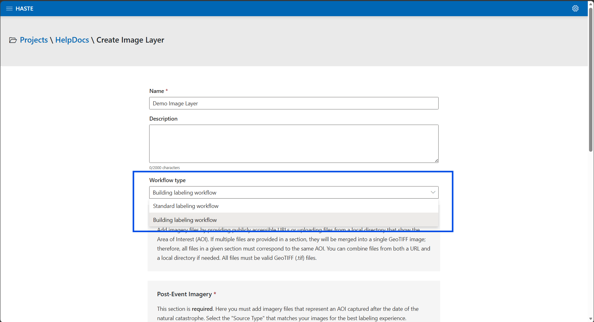
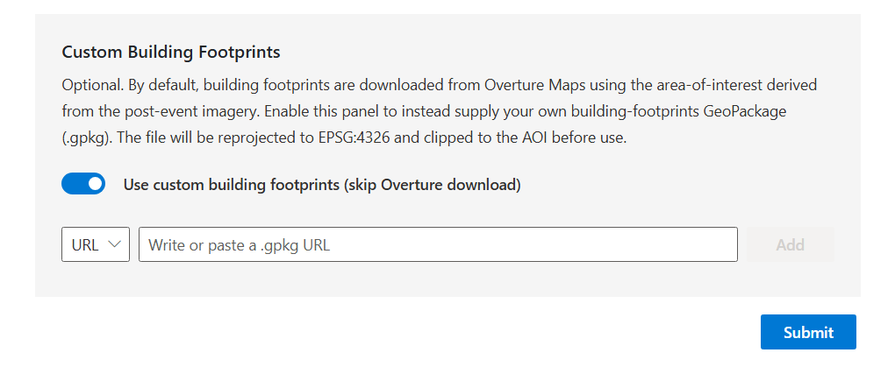
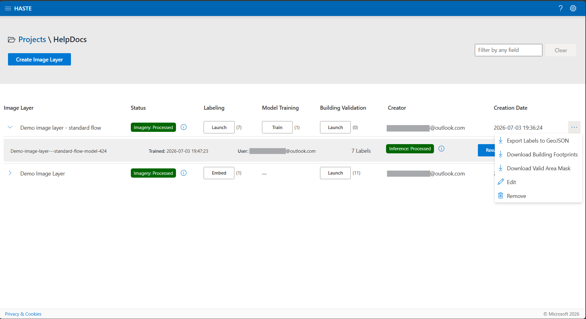

<!-- SOURCE OF TRUTH: This page duplicates the in-app Help Docs
     (ui/src/Components/HelpDocs/HelpDocsImageLayers.jsx). Keep the two in sync
     until the content is consolidated to a single source. -->

# Image Layers

## What is an Image Layer?

An image layer is the object upon which labeling, training, and predictions are
performed. An image layer can be a single TIFF file, or multiple TIFF files for the same
geographical Area of Interest.

If you have multiple satellite image files for a geographical area of interest, you can
upload them all together and HASTE will combine them into a single mosaic.

### Sources

There are multiple providers of satellite imagery for damage assessment, including but
not limited to the following:

- Planet Disaster Data — <https://source.coop/planet/disasterdata>
- Vantor Open Data Program — <https://vantor.com/company/open-data-program//>

### Formats

At the moment, HASTE only accepts TIFF (`.tif`) files as valid imagery formats.

## Sample data to try HASTE

Want to try HASTE without sourcing your own imagery first? The Microsoft AI for Good Lab
hosts a few public post-disaster samples you can drop straight into an image layer.

| Dataset | File | Use as | Best for |
|---------|------|--------|----------|
| **Black River** (Planet) | [`black-river_visual_mosaic_cog.tif`](https://opendata.aiforgood.ai/damage-assessment/demo-data/black-river_visual_mosaic_cog.tif) | Post-event imagery | Either workflow |
| **Black River** (Planet) | [`black-river_footprints.gpkg`](https://opendata.aiforgood.ai/damage-assessment/demo-data/black-river_footprints.gpkg) | Custom building footprints | Rapid Building Assessment |
| **Lahaina, Maui** — Vantor, 12 Aug 2023 | [`maxar_lahaina_8_12_2023-visual.tif`](https://opendata.aiforgood.ai/damage-assessment/demo-data/maxar_lahaina_8_12_2023-visual.tif) | Post-event imagery | Damage Mapping (train a model) |

**How to use them**

- **Imagery** — on the Create Image Layer form, paste the `.tif` URL into the post-event
  imagery URL field, or download it and upload the file. (These samples are post-event only;
  pre-event imagery is optional in both workflows.)
- **Footprints** — download the `.gpkg` and upload it under **Custom Building Footprints**
  (the URL option requires Azure Blob Storage or S3 hosting). Footprints are only needed for
  the **Building** workflow; the **Standard** workflow doesn't require them.

```{note}
The **Black River** post-event image (`black-river_visual_mosaic_cog.tif`) is a mosaic of all
the individual visual assets in
[Planet's Hurricane Melissa 2025 Black River disaster data](https://source.coop/planet/disasterdata/hurricane-melissa-2025/post-event/black-river).
This set pairs post-event imagery with matching building footprints, so it's a
complete example for {doc}`Rapid Building Assessment <rapid-building-assessment>`. The
**Lahaina** scene is imagery only — a good fit for {doc}`Damage Mapping <damage-mapping>`,
where footprints are pulled automatically from Overture Maps.
```

## Create a New Image Layer

To create an Image Layer, you must first create a project. Once this is done, select the
desired project from the list of projects. The project details will be displayed, which
includes a button called **Create Image Layer**. Clicking this will take you to the
Image Layer creation form.

```{admonition} Choose a workflow
:class: tip

The creation form has a **workflow** selector that determines what you can do with the
layer:

- **Standard** — draw labels and train a model for a wall-to-wall damage map
  ({doc}`Damage Mapping <damage-mapping>`).
- **Building** — embed building footprints and label them interactively
  ({doc}`Rapid Building Assessment <rapid-building-assessment>`).
```



### Browse the Open Data Catalog

The **Open Data Catalog** is the fastest way to add public disaster imagery without
finding and copying source URLs manually. On the Create Image Layer form, select
**Browse Open Data Catalog**, then:

1. Select a disaster event.
2. Filter scenes by provider (**Vantor** or **Planet**) and phase (**Pre** or **Post**).
3. Select a scene to preview its footprint and imagery on the map. The scene details
  include capture time, sensor, ground sample distance (GSD), cloud cover, off-nadir
  angle, sun elevation, and file size when the provider supplies them.
4. Optionally select **Set clip area** and draw a box on the map. HASTE applies this
  area to both pre- and post-event mosaics during processing. You can also filter the
  catalog to scenes that overlap the clip area. If you skip this step, HASTE processes
  the full scene. For large scenes, selecting a smaller area can reduce processing time
  and output size.
5. Select **+ Pre-event** or **+ Post-event** to add the scene to the corresponding
  imagery section.

Adding a catalog scene also fills in that section's imagery capture date and source
type when the catalog provides them. Review the populated values before creating the
layer, especially when combining multiple scenes.

The catalog currently browses the Vantor Open Data Program (formerly Maxar) and
Planet Disaster Data. You can still add imagery manually by URL or file upload when the scene
you need is not available in the catalog.

Add imagery files by providing publicly accessible URLs or uploading files from a local
directory that show the Area of Interest (AOI). You can also combine files from both a
URL and a local directory. If multiple files are provided in a section, they will be
merged into a single GeoTIFF image; therefore, all files in each section must correspond
to the same AOI. All files must be valid GeoTIFF (`.tif`) files.

<video controls width="100%" src="../_static/usage/imageLayers/image-layers-create-a-new-layer.mp4">
Your browser does not support the video tag.
</video>

### Custom building footprints (optional)

By default, HASTE downloads building footprints automatically from **Overture Maps** for the
area covered by your post-event imagery. If you'd rather use your own, expand the **Custom
Building Footprints** panel on the create form, turn on **Use custom building footprints
(skip Overture download)**, and supply a single **GeoPackage (`.gpkg`)** — either a publicly
accessible URL or a file upload (one or the other).

HASTE reprojects the file to EPSG:4326 and clips it to the imagery area before use. The
Overture and custom paths produce the same kind of footprint layer, so the rest of the
workflow is identical either way.



```{note}
A custom footprints file must be:

- **Format** — a GeoPackage (`.gpkg`), one file per layer, up to 500 MB.
- **Projected** — it must have a coordinate reference system embedded (any CRS works; it's
  reprojected to EPSG:4326).
- **Polygons** — Polygon / MultiPolygon features only (other geometry types are dropped).
- **Hosted (URL option)** — the URL must point to Azure Blob Storage or AWS S3.

Footprints are set when the layer is created and can't be changed afterward.
```

## Download layer data

An image layer's **⋯** (more actions) menu offers exports that don't depend on any model:

- **Export Labels to GeoJSON** — the labels drawn on the layer.
- **Download Building Footprints** — the footprints used for the layer (Overture or your own).
- **Download Valid Area Mask** — the area actually covered by the imagery.



## Edit an Image Layer

You can update the name and description for an image layer after it was created from the
Projects page.

<video controls width="100%" src="../_static/usage/imageLayers/image-layers-edit-a-layer.mp4">
Your browser does not support the video tag.
</video>

## Delete an Image Layer

You can delete an image layer using the ellipsis menu on the Projects page.

Deleting an image layer also deletes all its artifacts such as labels, model training
checkpoints, and predictions.

<video controls width="100%" src="../_static/usage/imageLayers/image-layers-delete-a-layer.mp4">
Your browser does not support the video tag.
</video>
