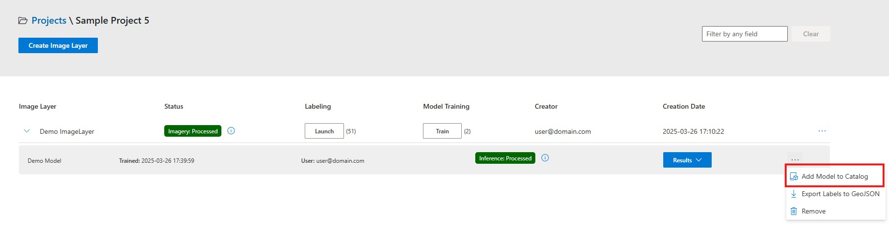
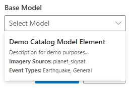
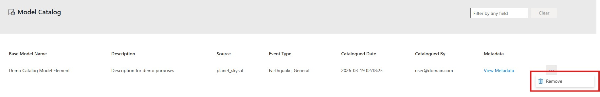

<!-- SOURCE OF TRUTH: This page duplicates the in-app Help Docs
     (ui/src/Components/HelpDocs/HelpDocsModelCatalog.jsx). Keep the two in sync
     until the content is consolidated to a single source. -->

# Model Catalog

The Model Catalog contains models for fine-tuning and for direct inference.
Each model declares which operations it supports. Compatible HASTE-trained
models can support both; the DINOv3 damage model supports inference only.

**Contents:** [Add a model](#add-a-model-to-catalog) -
[Train](#use-the-model-catalog-train-a-new-model-using-a-base-model) -
[Run inference](#run-inference-without-training) -
[Remove a model](#remove-a-model-from-the-model-catalog)

## Add a Model to Catalog

Once a model has been trained and its inference has been fully processed, you can add it
to the Model Catalog so it can be reused as a base model in future training runs. Follow
the steps below:

1. **Navigate to the Models table:** Go to your project page and locate the models table
   for the image layer whose model you want to catalog. Click the three-dot menu icon
   next to the model you want to catalog. The **Add Model to Catalog** option will only
   be available for models whose inference status is **Processed**.

   

2. **Fill in the form:** A dialog will appear with the following fields:
   - **Name:** Provide a unique, descriptive name for the model in the catalog (max 100
     characters).
   - **Description:** Add a detailed description of the model, including what it was
     trained on and its intended use (max 2000 characters).
   - **Metadata:** Optionally, add custom key-value metadata entries to tag and
     categorize the model. Click **Add Metadata** to create additional entries as
     needed.

3. **Submit:** Click the **Submit** button to add the model to the catalog. The model's
   project type and imagery source will be automatically associated, so it appears as a
   base model option in matching future training runs.

## Use the Model Catalog (Train a New Model using a Base Model)

The Base Model is a parameter of the model training process. For a complete guide on
training models, see [Train a new model](train-a-new-model).



## Run Inference Without Training

On a processed **standard** image layer, choose **Inference**, select a
compatible catalog model, optionally name the run, and choose **Start inference**.
This action is available in both project layouts and does not require training
labels. It uses the layer's post-event imagery and cached building footprints.

Each new submission creates an independent model row. It does not retrain the
catalog model, replace earlier results, or change the source model. Track progress
and cancel queued or running work from the new row; completed runs use the usual
Results menu, downloads, and reports. Validation accuracy still requires labels.

DINOv3 requires prepared three-band RGB8 imagery. Existing HASTE models require
their original input channels and normalization recipe. Unavailable models show
the compatibility reason instead of silently substituting settings. A model
without a reproducible inference recipe can still be available for fine-tuning.

Catalog loading failures show an error and Retry, rather than an empty list.
If submission fails ambiguously, retry without changing the model or name to
reuse the same request. Reopening the dialog starts a new intentional request.

## Remove a model from the Model Catalog

A model can be removed from the Model Catalog. This action does not delete the original
trained model from your project — it only removes it from the shared catalog so it will
no longer appear as a base model option.

1. **Navigate to the Model Catalog:** Open the Model Catalog page from the main
   navigation. You will see a table listing all cataloged models with details such as
   name, description, source, event type, and cataloged date.
2. **Locate the model:** Use the search bar to filter models by name, description, or any
   other field to quickly find the model you want to remove.
3. **Open the model menu:** Click the three-dot menu icon next to the model you want to
   remove, then select **Remove**.

   

4. **Confirm removal:** A confirmation dialog will appear asking if you want to remove
   the model from the catalog. Click **Yes** to proceed or **No** to cancel.
5. **Wait for completion:** The application will display a loading indicator while the
   model is being removed. Once complete, a success message will confirm the model has
   been removed.

```{important}
This action requires Administrator privileges.
```
