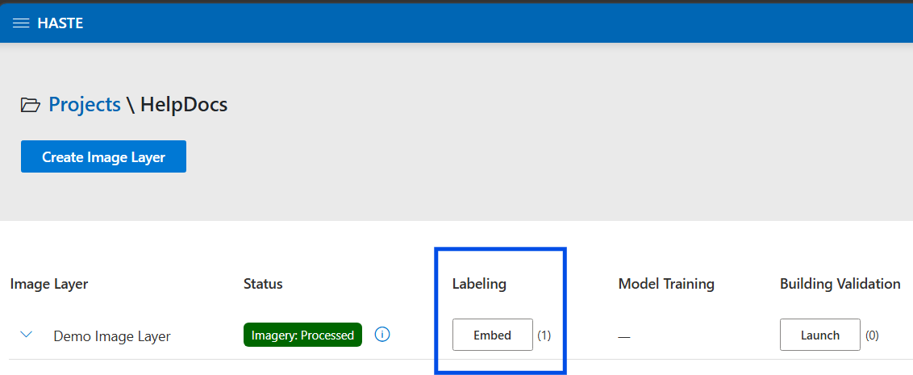
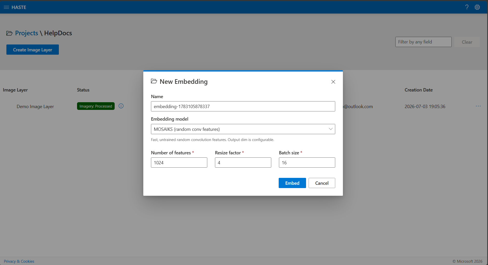
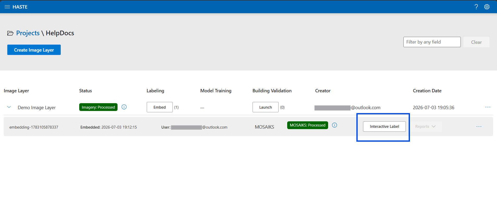
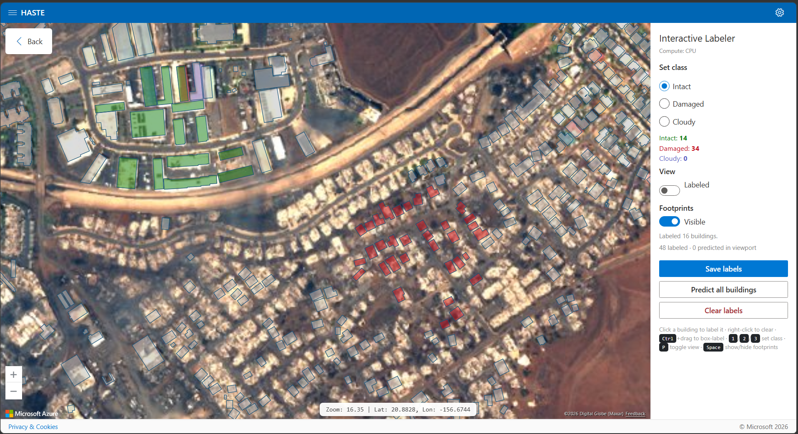
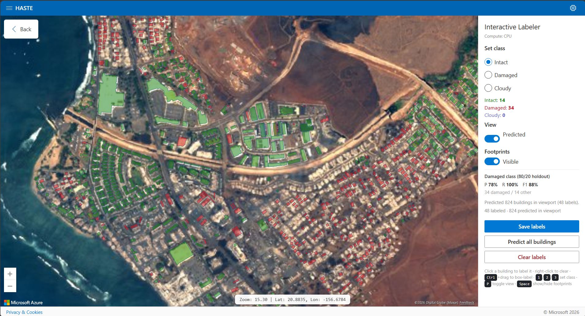
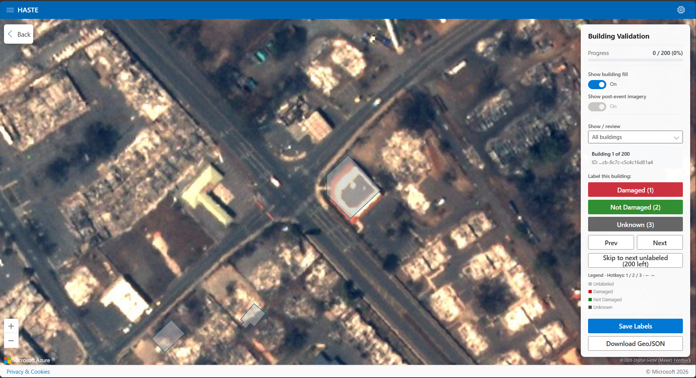
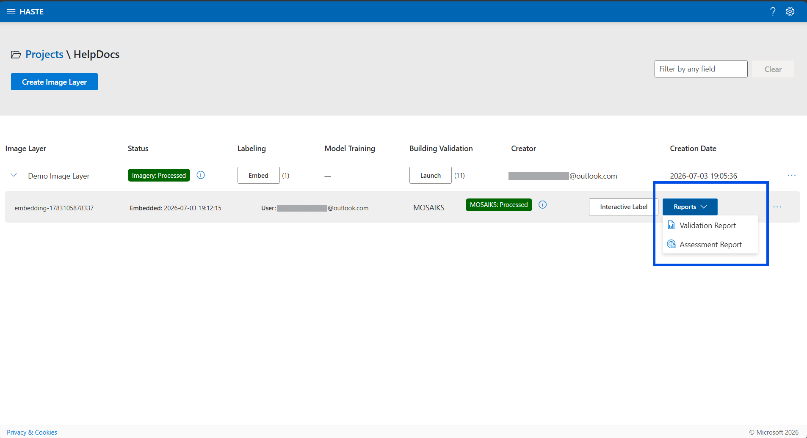
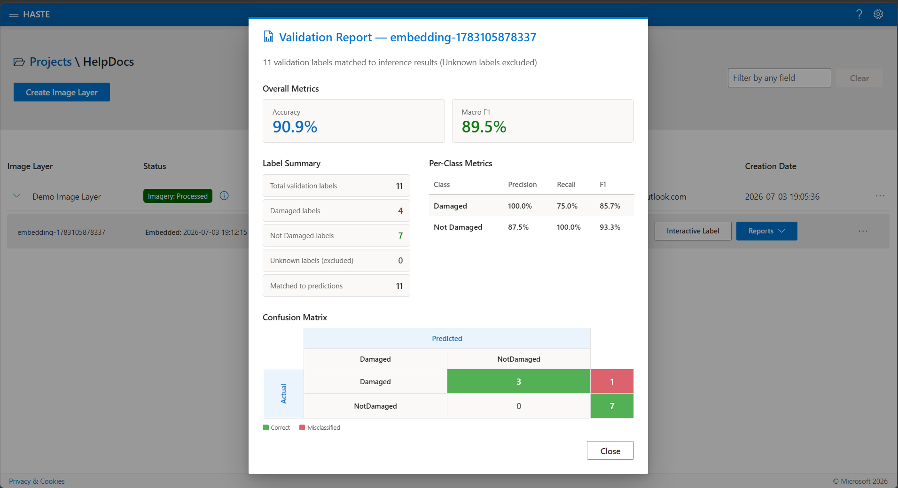
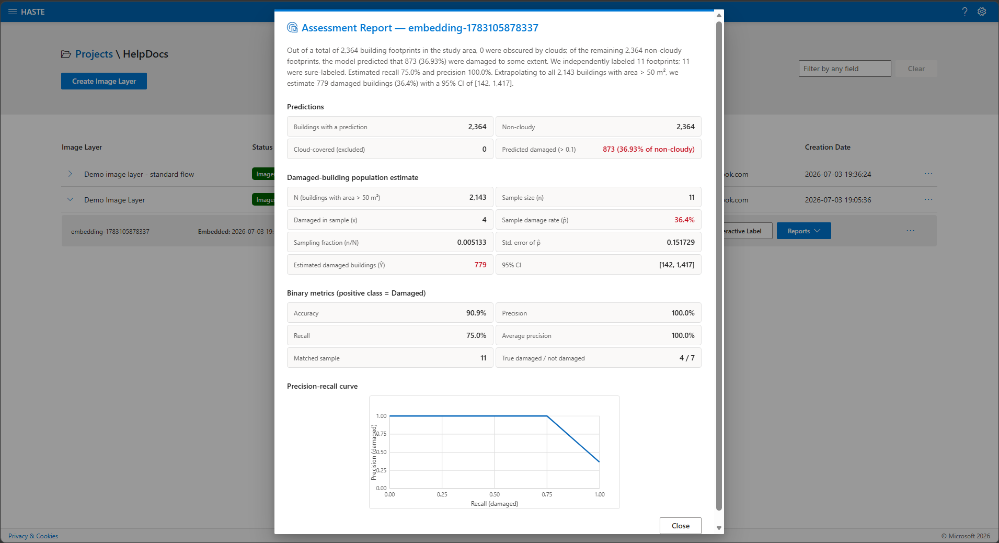

<!-- SOURCE: Authored from PR #42 (building labeling workflow) and the current UI
     code (ui/src/Components/InteractiveLabeler/*, BuildingValidation/*,
     CreateEditEmbeddingModal.jsx, ProjectManagement/EmbeddingModelRow.jsx).
     Screenshots captured from the app, stored under
     docs/_static/usage/interactive/. -->

# Rapid Building Assessment

**Goal: go from imagery to a per-building damage map in minutes — no model training job
required.** HASTE computes a compact "fingerprint" (an *embedding*) for every building
footprint, you label a handful of buildings, and a fast in-browser model predicts damage for
all of them. You then validate a sample and get accuracy metrics plus a damaged-building
estimate.

This is the recommended path when you have building footprints and want a quick answer. For
a continuous, pixel-level damage raster instead, see
{doc}`Damage Mapping with a Trained Model <damage-mapping>`.

```{admonition} The workflow at a glance
:class: tip

Building layer → **Embed** → **Interactive Label** (label a few, model predicts the rest) →
**Predict all buildings** → **Validate** a sample → **Reports**.
```

## Before you start

Create a project and add an image layer with the **Building** workflow selected, then load
your pre-/post-event imagery — building footprints are prepared automatically during
preprocessing. See {doc}`Projects <projects>` and {doc}`Image layers <image-layers>`. A
building-workflow layer shows an **Embed** button once its status is **Processed**.

Footprints are sourced automatically from Overture Maps, or you can supply your own — see
{doc}`Custom building footprints <image-layers>`.

```{admonition} Try it with sample data
:class: tip

New to HASTE? Use the **Black River** sample from {doc}`Image layers <image-layers>` (see
*Sample data to try HASTE*): create a **Building**-workflow layer with
`black-river_visual_mosaic_cog.tif` as the post-event imagery and
`black-river_footprints.gpkg` as the custom footprints.
```

## Step 1 — Embed the buildings

On the image layer, click the **Embed** button:



In the **New Embedding** dialog, configure:

- **Embedding backbone** — **MOSAIKS** (random convolutional features) or **DINOv2**
  (ViT-S/14 or ViT-B/14). MOSAIKS is the lightweight default.
- **Output dimensions** — features per building (MOSAIKS only; default 1024).
- **Resize factor** — how much to upscale the crop around each footprint (default 4 for MOSAIKS).
- **Batch size** — how many buildings to process at once.



Click **Embed** to queue the job. It analyzes the imagery around every footprint, producing
a feature vector per building plus vector tiles (PMTiles) for fast map display. When it
finishes, an **embedding row** appears with an **Interactive Label** button.



```{tip}
An *embedding* is a compact set of numbers capturing what each building looks like in the
imagery. Similar-looking buildings get similar embeddings — which is what lets a small model
generalize your labels to every building.
```

## Step 2 — Label interactively

Click **Interactive Label** to open the map-based labeler: satellite imagery (with a
pre-/post-event toggle), building footprints (visible at zoom 15 and closer), and a side
panel with the class selector, counts, a view toggle, and quality metrics.



- **Left-click** a building to label it with the selected class; **right-click** to remove a label.
- **Ctrl+drag** (Cmd+drag on macOS) to box-select and label many buildings at once.
- **Classes:** **Intact** (green), **Damaged** (red), **Cloudy** (purple) for obscured
  buildings; unlabeled buildings are gray.
- **Shortcuts:** `1`/`2`/`3` pick a class, `T` cycles, `P` toggles Labeled/Predicted view,
  `Space` shows/hides footprints, and `Ctrl+drag` box-labels buildings. Swipe comparison is
  on by default; `A`/`S`/`D` move its divider left/to an even split/right.

Once you've labeled at least **3 buildings in each of 2+ classes**, an in-browser model
(logistic regression, WebGPU-accelerated when available) trains automatically and predicts
damage for every building in view. Toggle **View: Labeled ↔ Predicted** to compare. The
panel shows holdout **precision / recall / F1 for the Damaged class** so you can watch
quality improve as you label diverse examples.



Under **Advanced**, **Show misclassified buildings** trains or reuses the current in-browser
model and highlights only human-labeled buildings whose current prediction differs. Correctly
classified and unlabeled buildings are not highlighted. This view is mutually exclusive with
Predicted and Uncertainty views and turns off if labels fall below the training threshold.

## Step 3 — Predict all buildings

- **Save labels** persists your manual labels so you can resume later (no full prediction).
- **Predict all buildings** trains on all your labels, scores **every** building, and saves
  the result as a predictions layer (a GeoPackage) — this unlocks the reports below.
- **Clear labels** removes your labels (including the saved copy); it cannot be undone.

```{important}
Labels and predictions are tied to a specific embedding. If footprints don't respond to
labeling or look stale, the layer likely needs to be **re-embedded** — re-run **Embed** and
open the new embedding row.
```

## Step 4 — Validate a sample

Open **Building Validation** for the layer to spot-check the predictions. It loads a random
sample of footprints (~200 by default) with the pre-/post-event imagery.



- Select a building and label it **Damaged**, **Not Damaged**, or **Unknown**.
- **Shortcuts:** `1`/`2`/`3` to label; arrow keys to move Prev/Next (auto-advances to the
  next unlabeled); `A` shows pre-event imagery (or basemap) and `D` shows post-event imagery.
  Filter by label status; a progress bar tracks your coverage.
- **Save Labels** to persist, or **Download GeoJSON** to export the labeled sample.

These human labels are the **ground truth** the reports compare predictions against
(**Unknown** labels are excluded from metrics).

## Step 5 — Review the reports

From the embedding row's **Reports** menu:



- **Validation Report** — matches predictions against your validation labels: overall
  accuracy, per-class precision/recall/F1 (Damaged, Not Damaged), macro-F1, and a confusion
  matrix.



- **Assessment Report** — summarizes predictions across the layer (total, scored vs.
  cloud-excluded, count and % predicted damaged) and, using your validation sample, estimates
  the **total damaged buildings with a 95% confidence interval**, plus a precision–recall
  curve.



## Tips

- Label a **diverse** set of buildings (varied roofs, colors, damage severity) rather than
  many similar ones.
- Use **Cloudy** for cloud-obscured buildings so they're excluded from scoring.
- Watch the **Damaged-class F1**; if recall is low, add more damaged examples before running
  **Predict all buildings**.
